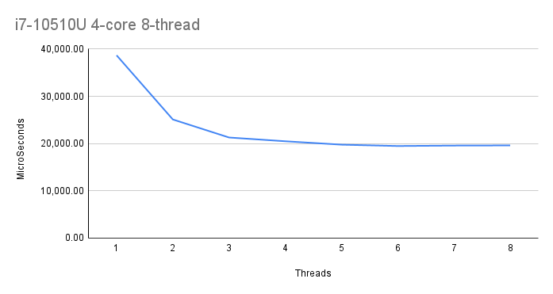
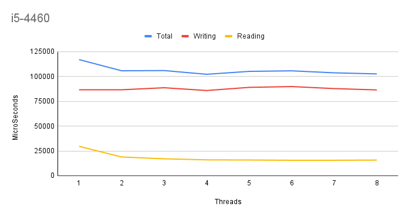

<mark>Template for your README. Remove all unused parts and instructions</mark>

# Lab work 3: Parallel File Indexing
Authors (team):
- [Mykhailo Bondarenko](https://github.com/michael-2956)
- [Bohdan Ruban](https://github.com/iamthewalrus67)
- [Ostap Trush](https://github.com/Adeon18)

Variant: _No Variant for this lab_
## Prerequisites

- gcc
- CMake
- boost
- Preferably a PC with multiple logical cores :D

### Compilation

_Run `./compile.sh` with the needed flags to compile the project(the binary will be in ./bin/)_

### Installation

1. Install all Prerequisites
2. Libs for python script:
```bash
pip install -r requirements.txt
```

### Usage

_The binary takes the config path as its argument._
```bash
./word_indexer <path_to_config_file>
```

_The config file has path to the directory to be indexed, thread count and output paths._
```
indir="data/to_index"     # Директорія для індексації
out_by_a="data/res_a.txt"  # Результати, посортовані за алфавітом
out_by_n="data/res_n.txt"  # Результати, посортовані за кількістю
indexing_threads=3
```

### Important!

_None for now..._

### Results

_We have a word indexer program that can index words in parallel._

We tested it on multiple computers to see how it would differ from machine to machine.

The first one is: `Intel Core i7-10510U(4-core 8-thread) @1.8Ghz | 16 GB DDR4 | 512 GB NVMe`:

- We can already see that after 4 threads there is almost no improvement due to reading being a bottleneck in this lab.
- The threads index the files quicker than they can compute them.

The next machine perfectly shows us the bottleneck that is reading and, suprisingly, writing.
`Intel Core i5-4460(4-core 4-thread) @3.4 GHz | 8 GB DDR3 | SSD / partition(read) HDD /home partition(write)`

- We can see that multithreaded indexing barely gives any improvement, because reading and writing is very long with writing longet than reading.
- This is because the /mnt folder, where the file is read from is a / partition which is on the **SSD**, but the results are written into /home, which is a partition on the **hard drive**.
- Hence, the reading and writing makes multiple threads almost useless.
- Also we see a spike in reading at 2 threads, that's because up to that point reading is not a bottleneck.


# Additional tasks
```
Додаткове завдання - 1 (2 бали): дослідити залежність часу виконання від кількості потоків на різних комп’ютерах і з різними наборами параметрів.
```

